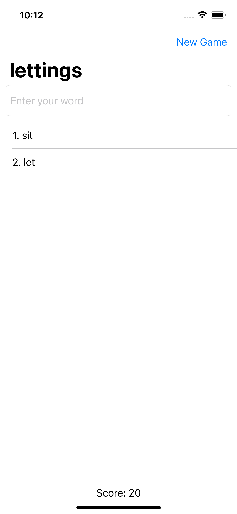
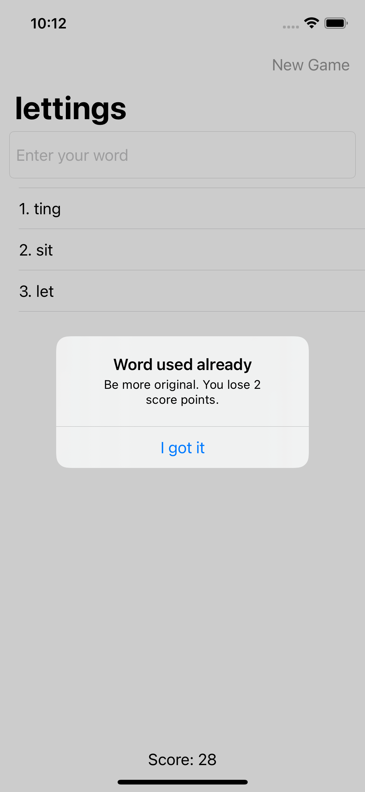
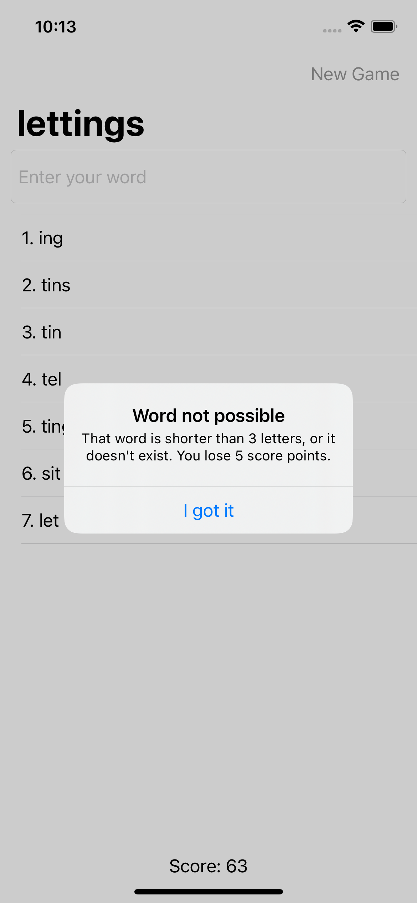

# Project5-WordScramble-UIKit
I made this app very similar that I made before using SwiftUI. User should find possible words from initial word and type them into text field. It will check if the word is allowed or no. If the word isn't allowed, the user would get an alert with the reason of decline. I don't use storyboard here and app is built very different from the course 100 Days Of Swift. Also there is score label, so user can see their results of start a brand new game :)

  
